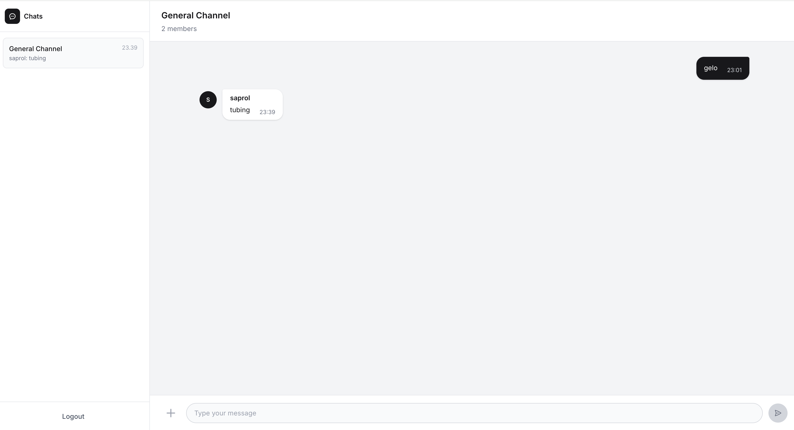

# Chat App

## Overview
Real-time chat room application using Vue 3 + TypeScript + Tailwind CSS,
connected to an existing Chat-as-a-Service (CaaS) backend via REST API and WebSocket.
User session is managed by the frontend via localStorage — CaaS only knows member_id.

## Preview




## Features

- Real-time messaging
- Typing indicator


---

## Tech Stack
- Vue 3 (Composition API)
- Vite
- TypeScript
- Tailwind CSS

---


## Getting Started

### Clone Repository

```bash
git clone https://github.com/saifulnizar/chat-app.git
cd chat-app-frontend
```

### Install Dependencies

```bash
npm install
```

### Configure Environment

Create `.env`:

```env
VITE_WS_URL=ws://localhost:9002
VITE_API_URL=http://localhost:9001
VITE_CHANNEL_ID=550e8400-e29b-41d4-a716-446655440000
VITE_APP_ID=default
```

### Run Development Server

```bash
npm run dev
```

Application will be available at:

```text
http://localhost:5173
```

## Build for Production

```bash
npm run build
```

## Project Structure

```
chat-app/
├── .env
├── .env.example
├── src/
│   ├── main.ts
│   ├── App.vue
│   ├── types/
│   │   └── chat.ts
│   ├── composables/
│   │   ├── useWebSocket.ts
│   │   └── useChat.ts
│   └── components/
│       ├── LoginScreen.vue
│       ├── ChatRoom.vue
│       ├── MessageList.vue
│       ├── MessageItem.vue
│       └── TypingIndicator.vue
```


## My Contributions

### Frontend
- Built the chat UI using Vue 3, TypeScript, and Tailwind CSS.
- Integrated REST APIs and WebSocket communication.

### Related Backend Work (Private Repository)
- Developed chat services using Golang.
- Implemented real-time messaging with WebSocket.
- Used NATS for event-driven communication between services.
- Stored chat data in ScyllaDB.
